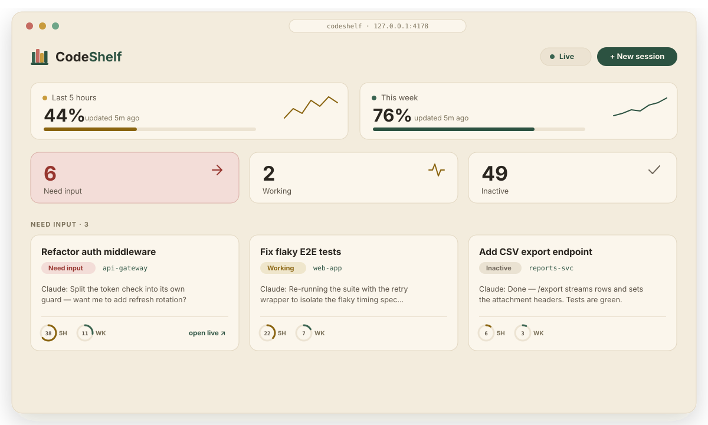

# 📚 CodeShelf — a local dashboard for Claude Code

**Monitor, search, and reply to all your [Claude Code](https://www.anthropic.com/claude-code) sessions from one page.** CodeShelf is a tiny, local, open-source web app that turns the files Claude Code already keeps on your Mac into a live mission-control: see which sessions are **working**, which are **waiting on you**, and which are **closed** — then browse, search, filter, and reply to any of them without hunting through terminal tabs.


> Run many Claude Code sessions at once? CodeShelf is the **Claude Code dashboard / session manager** that tells you, at a glance, which agent needs you next — and lets you reply straight into the live chat.

<p align="center">
  
</p>

---

## The problem

Claude Code lists your sessions **alphabetically**. That's fine for one or two — but once five, ten, or twenty agents are going at once, alphabetical order tells you nothing about *what actually needs you*. You end up cycling through terminal tabs and sidebar entries asking the same question over and over: **which one is blocked on me right now?**

CodeShelf reorders everything around **status, not spelling**. Sessions that **need your input** float to the top, **working** agents are clearly marked busy, and **inactive** ones get out of the way — so instead of scanning names, you glance once and know exactly where to go next. I built it to run many Claude Code sessions in parallel and actually keep up with all of them.

## Why CodeShelf?

If you keep several Claude Code agents running, the hard part isn't starting them — it's **knowing which one is blocked on you right now**. CodeShelf reads Claude Code's own session files (read-only) and gives you:

- a single board of every session, grouped by status, that refreshes live;
- one-click filtering by **status** or **project**;
- **full-text search** across every past conversation;
- a reply box that **types straight into the live Claude Code window** (so it also shows up on Remote Control and your phone) — or runs a headless turn when the session is closed;
- your **plan usage** (5-hour and weekly windows) up top.

It's **zero-dependency** (one `server.js`, no `npm install`), **local-only** (binds to loopback), and never writes to your `~/.claude` files — the only thing it writes is a reply you send on purpose.

## Quick start

```bash
git clone https://github.com/muhammad-hassnain/codeshelf.git
cd codeshelf
node server.js
```

Then open **http://127.0.0.1:4178**.

No build step, no dependencies — just **Node 18+**. (You can also run it with `npm start`.)

## Features

### Live session board
- **Signal tiles** — **Need input / Working / Inactive** counts, each with its own icon; click to filter, click again to clear.
- **Status at a glance** — every card shows status as **icon + text + color** (never color alone), the project, branch, message count, and when it last moved.
- **Auto-refresh** — the board updates every few seconds while a session is live; toggle it off with the **Live** switch.
- **Pin** — star the sessions you care about into a Pinned group up top.

### Browse & search
- **Full-text search** across every conversation (match-all-words, highlighted hits).
- **Project filter** — click a project chip to see just that folder's chats.
- **Rich transcripts** — messages render as **Markdown** (headings, **bold**, tables, lists, code blocks, quotes), just like the Claude window. Collapse tool steps, or switch between **All** and **Mine** (just the prompts you typed).

### Reply from the dashboard
- **Send to the live window** — on a live session, your message is typed **straight into the real Claude Code window** via macOS automation, so it syncs to **Remote Control** and your **phone**, and the reply streams back into CodeShelf. The app briefly comes forward to paste, then hands focus back to where you were.
- **Headless reply** — for closed sessions (or file attachments), send a `claude --resume … -p` turn that streams into the chat.
- **Model & effort** — pick **Opus / Sonnet / Haiku / Fable** and an **effort** level (Low → Max) per message (both server-allowlisted).
- **Attach & dictate** — attach images/files (click, **paste**, or **drag-and-drop**), or tap the **mic** to dictate. Attachments are saved under `~/.codeshelf/uploads` and the agent is granted read access to them.

### Start & hand off work
- **+ New session** — start a fresh Claude Code session (`claude --bg`) with a first message, in any folder under your home directory (jump to a recent project, browse, or create a folder on the spot).
- **Move context →** — spin up a new session seeded with the current one's goal and latest state.

### Usage & polish
- **Plan usage panel** — your **5-hour** and **weekly** windows with the current % and a trend sparkline.
- **Per-session usage** — two small donuts per card show this chat's **share** of your 5-hour and weekly token use.
- **Themes** — a flat "reading room" palette in **light / dark / follow-system**, native system fonts, no gradients or emoji-as-icons.
- **Opt-in notifications** when a session flips to needing you.

## Configuration

All optional — CodeShelf works with zero config.

| Env var | Default | Purpose |
| --- | --- | --- |
| `PORT` | `4178` | Port to serve on |
| `HOST` | `127.0.0.1` | Bind address — keep it loopback |
| `CLAUDE_CONFIG_DIR` | `~/.claude` | Where Claude Code stores sessions |
| `CLAUDE_BIN` | auto-detected | Path to the `claude` binary (for replies / new sessions) |
| `CE_ORG` | _(none)_ | Your claude.ai org slug — **set this** to enable the "open in app" deep links and live-window typing |
| `ANTHROPIC_API_KEY` | — | If set, the `claude` CLI uses it for replies instead of a login |

## How status is determined

Claude Code registers each running process at `~/.claude/sessions/<pid>.json` with a `status`. CodeShelf cross-checks that the process is alive and recently active:

| What it sees | Shown as |
| --- | --- |
| alive, `status: busy` | **Working** |
| alive, `status: idle` | **Need input** |
| no live process | **Inactive** |

Conversations come from the `~/.claude/projects/<project>/<uuid>.jsonl` transcripts. Everything is **read-only** — CodeShelf never modifies your Claude Code files.

## Sending needs a one-time CLI login

Replies and new sessions run the real `claude` CLI. The **desktop app's login lives in the macOS keychain and doesn't cover command-line runs**, so the first time you'll see a "not logged in" notice with the exact command, e.g.:

```bash
claude auth login
```

Run it once in a terminal (or set `ANTHROPIC_API_KEY` before starting the server) and replies work. A reply is a **real Claude Code turn** — it uses tokens and can run tools in that project.

## Typing into the live window (macOS)

The "Send to live window" path uses macOS GUI automation to paste your message into the real Claude Code window and press Return. The first time, macOS will ask you to grant **Accessibility** permission to whatever app runs `node server.js` (your terminal): **System Settings → Privacy & Security → Accessibility**. For the cleanest experience, run CodeShelf in a normal browser (not inside the Claude app) so "your window" is unambiguous. If it can't confirm the message landed, it keeps your text and tells you.

## Security

CodeShelf is a local server that exposes sensitive data and a code-executing reply endpoint, so it's hardened against malicious web pages in your browser:

- **Loopback bind** + **Host-header allowlist** (anti DNS-rebinding)
- **Per-start access token** required on every `/api` call
- **Origin / Sec-Fetch + JSON content-type** checks on write endpoints (anti-CSRF)
- **UUID validation**, `--` argument termination (anti CLI-injection), and a server-derived working directory (callers can't choose where an agent runs)
- One-reply / one-paste per session lock, and strict response headers (CSP, `nosniff`, `no-store`, `frame-ancestors 'none'`)

See [SECURITY.md](SECURITY.md) to report a vulnerability.

## Accessibility

- Status is encoded three ways — **icon + text + color** — so meaning never depends on color alone (color-blind safe).
- Full keyboard support with visible focus, focus-trapped dialogs, a skip link, ARIA roles/labels (including labelled sparklines), and `role=log` conversations.
- Honors `prefers-reduced-motion` and `prefers-contrast: more`; the palette meets **WCAG AA** contrast in both themes.

## Requirements

- **macOS** — the live-window typing and the plan-usage panel are macOS-specific; the session board reads `~/.claude` and could be adapted to other platforms.
- **Node 18+**
- **Claude Code** installed, with the `claude` CLI logged in (only needed for sending/creating sessions).

## Project layout

```
server.js             Node backend (zero deps): sessions, usage, auth, live-window typing, hardened API + UI
public/index.html     App shell
public/style.css      "Reading room" theme — warm paper/ink (light) + walnut/leather (dark), system fonts
public/theme-init.js  Applies the saved/system theme before first paint
public/app.js         Frontend: icons, usage, board, drawer, composer, Markdown rendering
.claude/launch.json   Lets the Claude app preview launch it
AGENTS.md             Guide for AI coding agents working in this repo
```

## Contributing

PRs welcome — see [CONTRIBUTING.md](CONTRIBUTING.md). Working on this with an AI agent (Claude Code, Cursor, …)? Point it at [AGENTS.md](AGENTS.md).

## License

[MIT](LICENSE) © Muhammad Hassnain

> CodeShelf is an independent, community project. It is **not affiliated with, endorsed by, or sponsored by Anthropic**. "Claude" and "Claude Code" are trademarks of Anthropic; they're used here only to describe what the tool works with.

---

<sub>**Keywords:** Claude Code dashboard · Claude Code session manager · monitor Claude Code sessions · Claude Code web UI · manage multiple Claude Code agents · Claude Code session viewer · reply to Claude Code from a browser · Anthropic Claude Code tools · local self-hosted Claude Code monitor.</sub>

<sub>Suggested GitHub topics: `claude-code` · `claude` · `anthropic` · `dashboard` · `ai-agents` · `developer-tools` · `macos` · `self-hosted` · `zero-dependency` · `nodejs`</sub>
